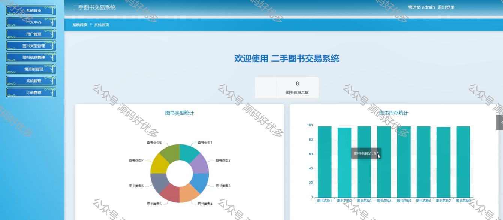

 
## 查看主页获取源码

> **作者介绍**： **✌**全网粉丝10W+本平台特邀作者、博客专家、CSDN新星计划导师、java领域优质创作者,博客之星、掘金/华为云/阿里云/InfoQ等平台优质作者、专注于毕业项目实战 **✌**

  

### 一、作品包含

源码+数据库+设计文档万字LW+PPT+全套环境和工具资源+部署教程

### 二、项目技术

前端技术：Html、Css、Js、Vue、Element-ui

数据库：MySQL

后端技术：Java、Spring Boot、MyBatis

  

### 三、运行环境

开发工具：IDEA/eclipse

数据库：MySQL5.7

数据库管理工具：Navicat10以上版本

环境配置软件： JDK1.8+Maven3.6.3

前端Nodejs：14

  

### 四、项目介绍
项目编号：springbootA069

结合现有二手图书交易体系的特点，运用新技术，构建了以 springboot为基础的二手图书交易信息化管理体系。首先，以需求为依据，根据需求分析结果进行了系统的设计，并将其划分为管理员和用户二种角色和多个主要模块：用户、图书信息、留言板、系统和订单等。使用目前市场主流的技术springboot框架进行项目构建，基于B/S架构模式，使用Java开发语言和MySQL数据库对系统进行高内聚低耦合的设计，最终完成了二手图书交易系统的实现。

### 五、运行截图

